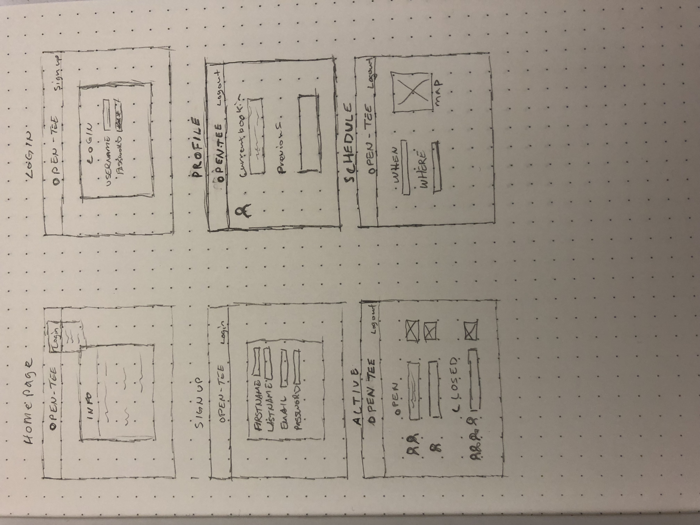

# Open Tee

### Planning Process:
Frame work sketch:

Trello board:

### User Story:
As a golfer, You sometimes want to one stop location to search for courses and get some information then schedule a tee time in one place.

### Built With:
* HTML
* CSS
* JavaScript
* Node
* Express, Sequelize & numerous other Node modules
* Yelp API (Yelp Fusion)

### Open Tee Deployed:
[Heroku](http://opentee.herokuapp.com)

### If I Had More Time:
* click on 'schedule tee time' and have the Schedule form auto fill with course information from search results.
* able to post active tee times on public site and have other users join active tee time until it hits 4 player limit.
* some extra styling to search page.
